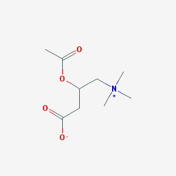

## Multi-Class Multi-label Image classification with MXNet Gloun 

This example involves labeling chemical structures with elements in them.

For example: Below image of Acetylcarnitine will be tagged as containing Carbon, Hydrogen, Nitrogen and Oxygen.

 

[Notebook MXNet_MultiLable_ChemStructToElements-checkpoint.ipynb](https://github.com/madutv/deep-abyasa/blob/master/MXNet_MultiLable_ChemStructToElements.ipynb) 
has the implementation using Resnet18. 

**Notes:** 

1) Dataset for this exercise is extracted from the awesome PubChem. 
This data, along with labels are available at https://storage.googleapis.com/chem-dl/chem_struct_to_elem.tar.gz
2) Code is built based on examples provided in [Gluon-cv turorials](https://gluon-cv.mxnet.io/)

 

